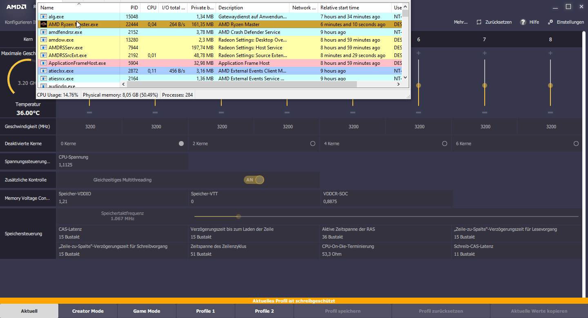

# DeviceDriverInterceptor
Boilerplate code for intercepting communication between programs and a driver from user mode

Uses Minhook for hooking DeviceIoControl

Includes some stuff i reversed from AMD RYZEN MASTER

